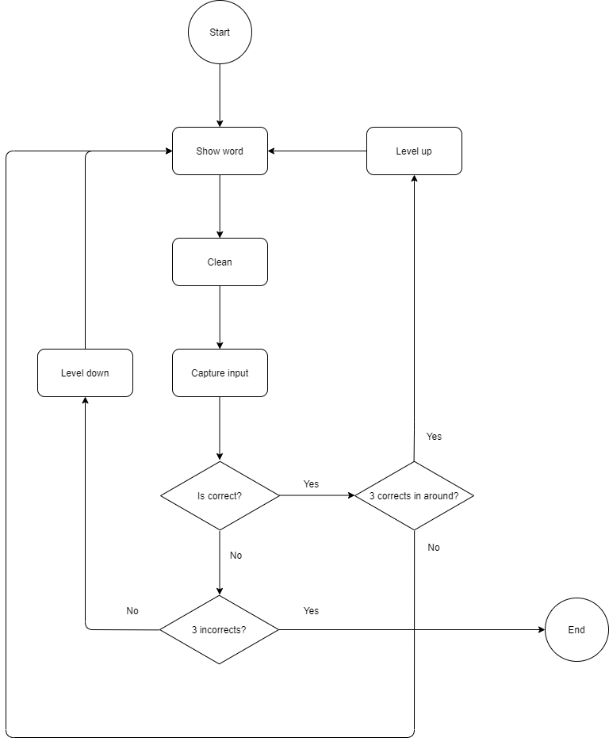

# memory-challenge

## Do you wanna play?

[TBD](https://link)

## Install in your computer

### Download

Can download the project with the simple command of `git clone`, this project don't have any special instructions.

### Create environments variables

Only need create the file `.dotenv`, following the contain of `.dotenv-example`

### Install dependencies

In root folder, execute `npm install`

### Run

In root folder, execute `npm start` and enjoy 🕹️!

## Flowchart

